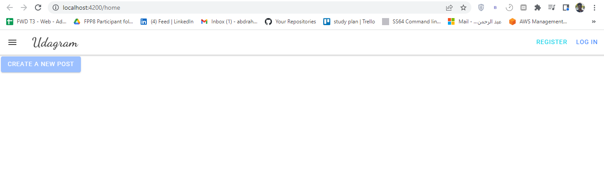
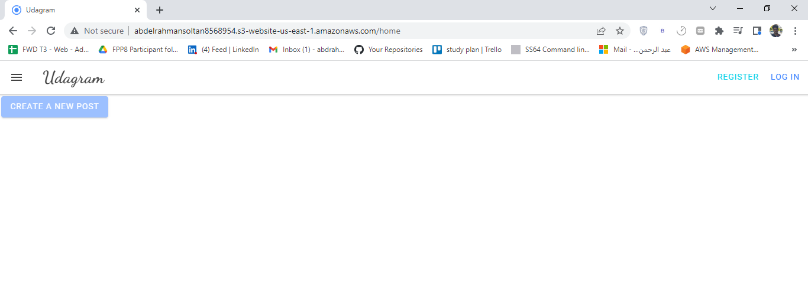

# Hosting-a-Full-Stack-Application

[](https://circleci.com/gh/circleci/circleci-docs)

<div id="top"></div>


<!-- PROJECT LOGO -->
<br />
<div align="center">

  <h3 align="center">Hosting-a-Full-Stack-Application</h3>

  <p align="center">
  <a href="http://abdelrahmansoltan8568954.s3-website-us-east-1.amazonaws.com/">View Demo</a>
    ·
    <a href="https://github.com/abdrahmansoltan/Hosting-a-Full-Stack-Application/issues">Report Bug</a>
  </p>
</div>

<!-- TABLE OF CONTENTS -->
<details>
  <summary>Table of Contents</summary>
  <ol>
    <li>
      <a href="#about-the-project">About The Project</a>
      <ul>
        <li><a href="#built-with">Built With</a></li>
      </ul>
    </li>
    <li>
      <a href="#getting-started">Getting Started</a>
      <ul>
        <li><a href="#installation">Installation</a></li>
      </ul>
    </li>
    <li><a href="#screenshots">Screenshots</a></li>
    <li><a href="#contributing">Contributing</a></li>
    <li><a href="#acknowledgments">Acknowledgments</a></li>
  </ol>
</details>

<!-- ABOUT THE PROJECT -->

## About The Project

In this project it's required to take a newly developed Full-Stack application built for a retailer and deploy it to a cloud service provider so that it is available to customers.

By Taking a developed full stack application and deploying it to a cloud service provider so that it is available to customers. This application contains the main components of a 3-tier full stack application (UI, API, and Database).

<p align="right">(<a href="#top">back to top</a>)</p>

### Built With

- Typescript
- Node.js
- Epress framework
- Angular
- postgreSQL
- AWS
- Circle-CI

<p align="right">(<a href="#top">back to top</a>)</p>

---

<!-- GETTING STARTED -->

## Getting Started

This project require some prequesites and dependenscies to be installed, you can find the instructions below

> To get a local copy, follow these simple steps :

### Installation

#### installing Locally

1. Clone the repo
   ```sh
   git clone https://github.com/abdrahmansoltan/Hosting-a-Full-Stack-Application.git
   ```
2. go to project folder

   ```sh
   cd Hosting-a-Full-Stack-Application
   ```

3. install dependenscies

   ```bash
   npm run frontend:install
   npm run backend:install
   ```

4. create databases

   - connect to the default postgres database as the server's root user

     ```bash
     psql -U postgres
     ```

   - In psql run the following to create a user

     ```bash
     CREATE USER project_user WITH PASSWORD 'password123';
     ```

   - In psql run the following to create the dev database

     ```bash
     CREATE DATABASE udagram;
     ```

   - Connect to the databases and grant all privileges

     ```bash
     \c udagram;
     GRANT ALL PRIVILEGES ON DATABASE udagram TO project_user;
     ```

5. Enviromental Variables Set up

   - Here are the environmental variables that needs to be set in a .env file. This is the default setting that I used for development, but you can change it to what works for you.

   ```
     POSTGRES_HOST="localhost"
     DB_PORT=5432
     PORT=8080
     POSTGRES_USERNAME= "postgres"
     POSTGRES_PASSHORD= "12345"
     RDS_DIALECT="postgres"
     POSTGRES_DB="udagram"
     AWS_REGION=""
     AWS_PROFILE=""
     AWS_BUCKET=""
     URL="http://localhost"
     AWS_ACCESS_KEY_ID=""
     AWS_SECRET_ACCESS_KEY=""
     JWT_SECRET="hello-from-other-side"
   ```

6. Run development server

   ```sh
   cd udagram-api npm run dev
   ```

- or: Run frontend server

  ```bash
  cd udagram-frontend npm start
  ```

<p align="right">(<a href="#top">back to top</a>)</p>

---

### Ports & EndPoints

#### Ports

- Server runs on port `8080`
- Database on port `5432`

---

## Screenshots

### Running Locally



### Running on S3

App is running globally on [http://abdelrahmansoltan8568954.s3-website-us-east-1.amazonaws.com/](http://abdelrahmansoltan8568954.s3-website-us-east-1.amazonaws.com/)


---

<!-- CONTRIBUTING -->

## Contributing

Contributions are what make the open source community such an amazing place to learn, inspire, and create. Any contributions you make are **greatly appreciated**.

If you have a suggestion that would make this better, please fork the repo and create a pull request. You can also simply open an issue with the tag "enhancement".
Don't forget to give the project a star! Thanks again!

1. Fork the Project
2. Create your Feature Branch (`git checkout -b feature/AmazingFeature`)
3. Commit your Changes (`git commit -m 'Add some AmazingFeature'`)
4. Push to the Branch (`git push origin feature/AmazingFeature`)
5. Open a Pull Request

<p align="right">(<a href="#top">back to top</a>)</p>

<!-- ACKNOWLEDGMENTS -->

## Acknowledgments

- [Udacity](https://github.com/udacity)
