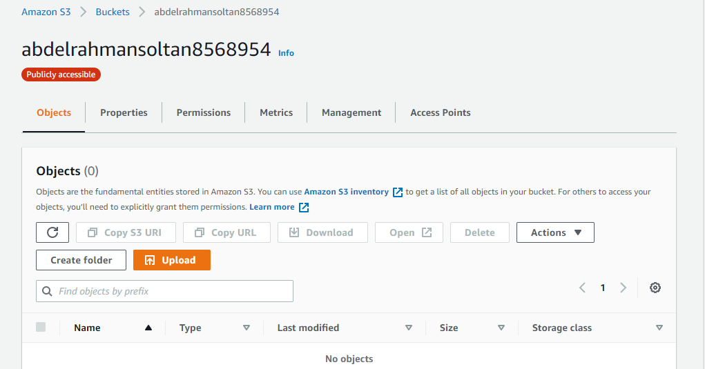

# Hosting-a-Full-Stack-Application
taking a developed full stack application and deploying it to a cloud service provider so that it is available to customers. This application contains the main components of a 3-tier full stack application (UI, API, and Database).
# Hosting a Full-Stack Application

In this project it's required to take a newly developed Full-Stack application built for a retailer and deploy it to a cloud service provider so that it is available to customers.

---

## Database: RDS DB

AWS RDS PostgreSQL Database info Sequelize: 
- postgres://postgres:postgres@[database-2.cobsdpmu9g5k.us-east-1.rds.amazonaws.com](database-2.cobsdpmu9g5k.us-east-1.rds.amazonaws.com):5432/postgres

---

## Elastic Beanstalk

---

## S3 Bucket

