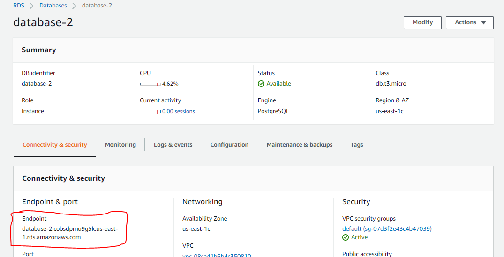
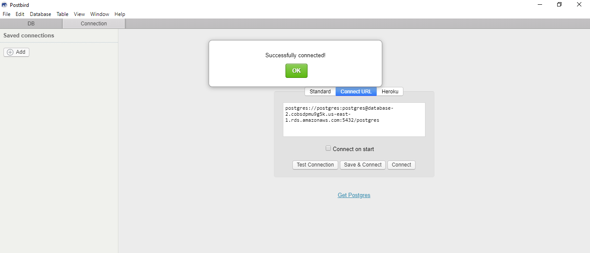
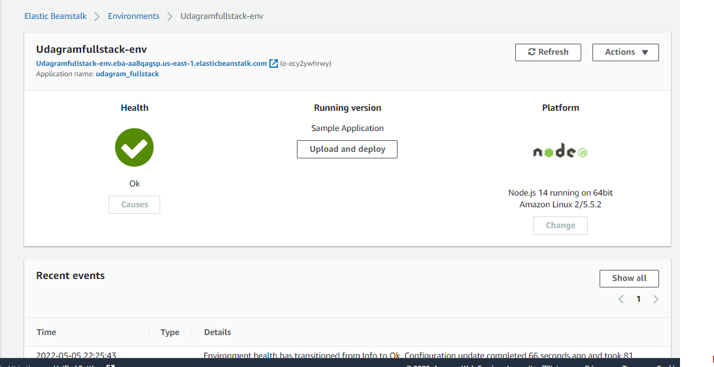
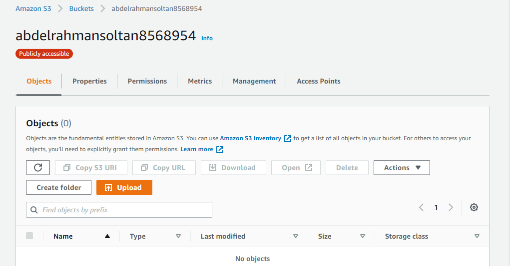

## Architecture Diagram

---

## Database: RDS DB

AWS RDS PostgreSQL Database info Sequelize:

- postgres://postgres:postgres@[database-2.cobsdpmu9g5k.us-east-1.rds.amazonaws.com](database-2.cobsdpmu9g5k.us-east-1.rds.amazonaws.com):5432/postgres

  

- connection status

  

---

## Elastic Beanstalk

EB URL: [ http://Udagram-env.eba-5psjdw4u.us-east-1.elasticbeanstalk.com](http://Udagram-env.eba-5psjdw4u.us-east-1.elasticbeanstalk.com)

---

## S3 Bucket

S3 Bucket URL: [http://abdelrahmansoltan8568954.s3-website-us-east-1.amazonaws.com/](http://abdelrahmansoltan8568954.s3-website-us-east-1.amazonaws.com/)

